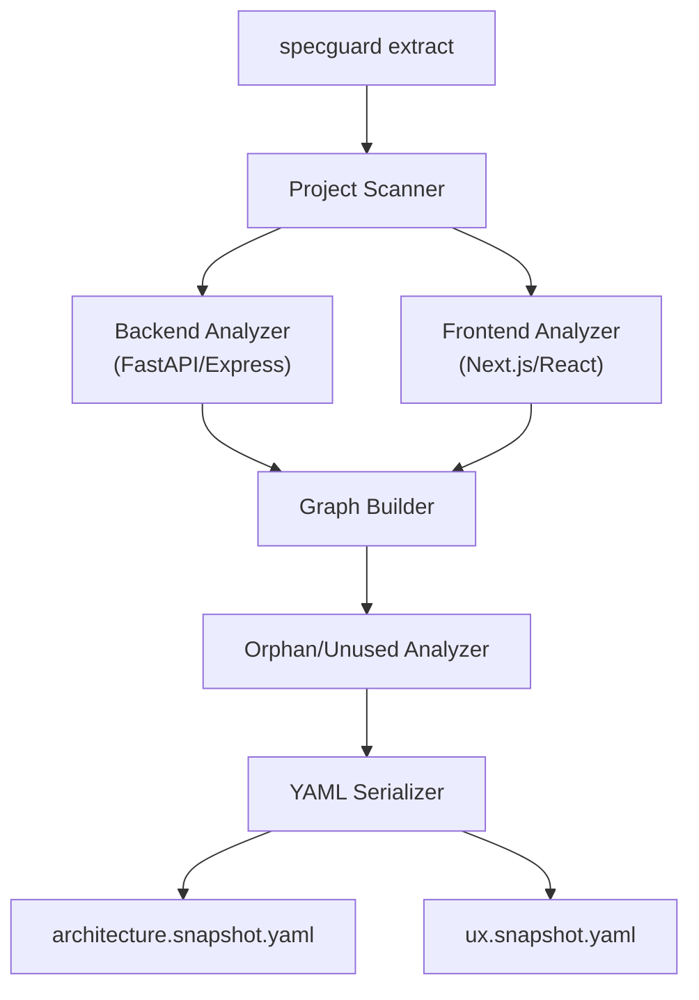

# SpecGuard Phase 1 Pipeline

```mermaid
flowchart TB
  CLI["specguard extract"] --> Scanner["Project Scanner"]
  Scanner --> Backend["Backend Analyzer\n(FastAPI/Express)"]
  Scanner --> Frontend["Frontend Analyzer\n(Next.js/React)"]
  Backend --> Graph["Graph Builder"]
  Frontend --> Graph
  Graph --> Orphan["Orphan/Unused Analyzer"]
  Orphan --> Writer["YAML Serializer"]
  Writer --> Arch["architecture.snapshot.yaml"]
  Writer --> UX["ux.snapshot.yaml"]
```
